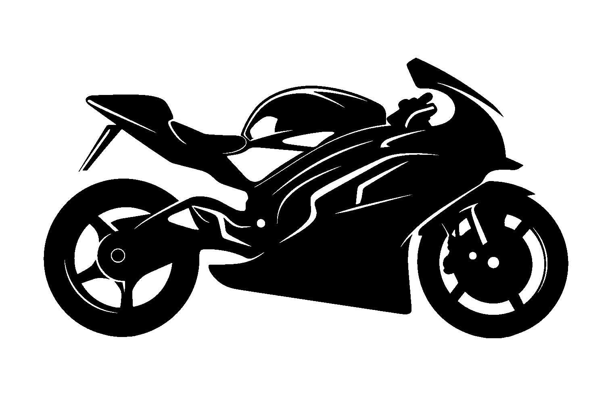

# 🧪 Taller - Análisis de Figuras Geométricas: Centroide, Área y Perímetro

## 📅 Fecha
`2025-04-30`

---

## 🎯 Objetivo del Taller

Detectar formas simples (contornos) en imágenes binarizadas y calcular propiedades geométricas como área, perímetro y centroide. También se visualiza la información en la imagen final y se exportan los resultados.

---

## 🧠 Conceptos Aprendidos

- [x] Segmentación de imágenes
- [x] Cálculo de propiedades geométricas
- [ ] Transformaciones geométricas (escala, rotación, traslación)
- [ ] Shaders y efectos visuales
- [ ] Entrenamiento de modelos IA
- [ ] Comunicación por gestos o voz
- [x] Otro: Detección de contornos con OpenCV

---

## 🔧 Herramientas y Entornos

- Python (`opencv-python`, `numpy`, `matplotlib`)
- Google Colab

📌 Usa las herramientas según la [guía de instalación oficial](./guia_instalacion_entornos_visual.md)

---

## 📁 Estructura del Proyecto

```
2025-05-02_analisis_figuras/
├─
├── python/ 
│   ├── img/moto.jpg
│   ├── taller_analisis_figuras_geometricas.ipynb
├── resultados/
│   ├── binarizada.jpg
│   ├── contornos.jpg
│   ├── contornosetiquetados.jpg
├── README.md
```

## 🧪 Implementación

### 🔹 Etapas realizadas
1. Carga y binarización de la imagen.
2. Detección de contornos con `cv2.findContours`.
3. Cálculo de propiedades geométricas: área, perímetro y centroide.
4. Visualización de contornos y etiquetas sobre la imagen.
5. Guardado de resultados en imágenes.

### 🔹 Código relevante

```python
for contour in found_contours:
    area = cv2.contourArea(contour)
    perimeter = cv2.arcLength(contour, True)
    M = cv2.moments(contour)
    if M['m00'] != 0:
        cx = int(M['m10'] / M['m00'])
        cy = int(M['m01'] / M['m00'])
    label = f"A:{int(area)} P:{int(perimeter)} ({cx},{cy})"
    cv2.putText(labeled_image, label, (cx - 40, cy - 10),
                cv2.FONT_HERSHEY_SIMPLEX, 0.7, (0, 255, 0), 2)
```

---

## 📊 Resultados Visuales




> ❌ Este taller no requiere GIF, pero se incluyen capturas de los resultados intermedios.

---

## 🧩 Prompts Usados

```text
"Generate a Python project using OpenCV that loads a grayscale image, binarizes it, detects contours, calculates area, perimeter, and centroid for each shape, labels them on the image, and saves the outputs with clear visualization and markdown explanations."
```

📎 Usa buenas prácticas de prompts según la [guía de IA actualizada](./guia_prompts_inteligencias_artificiales_actualizada.md)

---

## 💬 Reflexión Final

Este taller permitió reforzar el uso de OpenCV para segmentar imágenes, calcular métricas clave como el área y el perímetro, y visualizar resultados directamente sobre la imagen. Fue especialmente útil para entender el papel de los momentos geométricos y su aplicación práctica para localizar centroides.

Una parte interesante fue la integración de diferentes etapas (binarización, detección, cálculo y visualización) en un flujo de trabajo claro y automatizable. En futuros proyectos, se podría extender esta lógica para clasificar figuras automáticamente y contar objetos de interés en imágenes más complejas.

---

## 👥 Contribuciones Grupales (si aplica)

```markdown
- Implementación de la lógica de detección de contornos
- Cálculo y visualización de métricas geométricas
- Generación y organización de resultados
```

---

## ✅ Checklist de Entrega

- [x] Carpeta `2025-04-30_analisis_figuras`
- [x] Código limpio y funcional
- [ ] GIF incluido con nombre descriptivo (no requerido)
- [x] Visualizaciones o métricas exportadas
- [x] README completo y claro
- [x] Commits descriptivos en inglés

---
