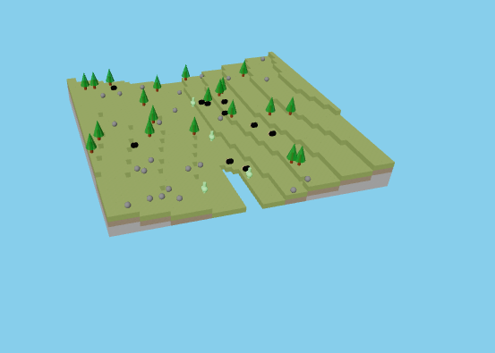

# 🧪 Taller Three.js Mundo Voxel

## 📅 Fecha
2025-05-24 – Fecha de realización

---

## 🎯 Objetivo del Taller

Construir un mundo 3D tipo Minecraft usando Three.js, con bloques y otras formas primitivas (cubos, cilindros, conos, esferas), aplicando materiales PBR, iluminación simple y generación de contenido procedural como árboles, rocas o criaturas.

---

## 🧠 Conceptos Aprendidos

Lista los principales conceptos aplicados:

- [x] Modelado Procedural: creación de terreno y objetos con código.
- [x] Mapeo UV y Materiales PBR: aplicar texturas físicas (albedo, normal, rugosidad).
- [x] Shaders Simples: realce de efectos visuales y texturizado.
- [x] Luces: iluminación básica para ambientar la escena.
- [x] Síntesis Visual: diseño inmersivo con elementos naturales y criaturas simples.
- [ ] Otro: _______________________

---

## 🔧 Herramientas y Entornos

Especifica los entornos usados:

- Python (`opencv-python`, `torch`, `mediapipe`, `diffusers`, etc.)
- Unity (versión LTS, XR Toolkit, Shader Graph)
- Three.js / React Three Fiber
- Jupyter / Google Colab

📌 Usa las herramientas según la [guía de instalación oficial](./guia_instalacion_entornos_visual.md)

Herramientas específicas utilizadas:
- Three.js
- React Three Fiber
- Texturas PBR (ambientCG, Polyhaven)

---

## 📁 Estructura del Proyecto
2025-05-24_taller_threejs_mundo_voxel/
├── entorno/ # threejs/
├── datos/ # texturas, modelos (si aplica)
├── resultados/ # capturas, métricas, gifs
├── README.md

📎 Sigue la estructura de entregas descrita en la [guía GitLab](./guia_gitlab_computacion_visual.md)

---

## 🧪 Implementación

Explica el proceso:

### 🔹 Etapas realizadas
1. Configuración del entorno de desarrollo con Three.js y React Three Fiber.
2. Creación de la geometría y el terreno del mundo voxel de forma procedural.
3. Aplicación de materiales PBR y texturas al terreno y objetos.
4. Implementación de iluminación básica en la escena.
5. Generación procedural de elementos como árboles y rocas.
6. Integración de controles de cámara para navegación.

### 🔹 Código relevante

Incluye un fragmento que resuma el corazón del taller:

```jsx
import { Canvas } from '@react-three/fiber'
import { OrbitControls } from '@react-three/drei'
import { VoxelWorld } from './components/VoxelWorld'
import './App.css'

function Scene() {
  return (
    <>
      {/* Color de fondo */}
      <color attach="background" args={['#87CEEB']} />

      {/* Luces */}
      <ambientLight intensity={0.5} />
      <directionalLight position={[5, 5, 5]} intensity={1} />

      {/* Mundo Voxel */}
      <VoxelWorld />

      {/* Controles de órbita */}
      <OrbitControls />
    </>
  )
}

function App() {
  return (
    <div style={{ width: '100vw', height: '100vh' }}>
      <Canvas camera={{ position: [15, 15, 15], fov: 75 }}>
        <Scene />
      </Canvas>
    </div>
  )
}

export default App
```

---

## 📊 Resultados Visuales

### 📌 Este taller **requiere explícitamente un GIF animado**:

> ✅ Si tu taller lo indica, debes incluir **al menos un GIF** mostrando la ejecución o interacción.

- Usa `Peek`, `ScreenToGif`, `OBS`, o desde Python (`imageio`) para generar el GIF.
- **El nombre del GIF debe ser descriptivo del punto que estás presentando.**
- Ejemplo correcto:
  `deteccion_colores_rojo_verde_torres.gif`
  `movimiento_robot_esquiva_obstaculos_gomez.gif`
  `shader_gradiente_temporal_lopez.gif`

🧭 [Ver guía para crear GIFs](./guia_generar_gif.md)

```markdown

```

> ❌ No se aceptará la entrega si falta el GIF en talleres que lo requieren.

---

## 🧩 Prompts Usados

Enumera los prompts utilizados:

*(Si utilizaste prompts para generar texturas o algún otro recurso visual, enúmeralos aquí)*

📎 Usa buenas prácticas de prompts según la [guía de IA actualizada](./guia_prompts_inteligencias_artificiales_actualizada.md)

---

## 💬 Reflexión Final

Responde en 2-3 párrafos:

- ¿Qué aprendiste o reforzaste con este taller?
- ¿Qué parte fue más compleja o interesante?
- ¿Qué mejorarías o qué aplicarías en futuros proyectos?

En este taller, la parte de crear el terreno procedural y añadir las texturas fue particularmente interesante y compleja. Me permitió profundizar en las técnicas de generación de geometría en tiempo de ejecución y en la aplicación correcta de materiales PBR para lograr un aspecto visual convincente.

---

## 👥 Contribuciones Grupales (si aplica)

Describe exactamente lo que hiciste tú:

*(Describe aquí tus contribuciones específicas si este fue un proyecto grupal)*

---

## ✅ Checklist de Entrega

- [x] Carpeta `YYYY-MM-DD_nombre_taller`
- [x] Código limpio y funcional
- [ ] GIF incluido con nombre descriptivo (si el taller lo requiere) - *Actualmente solo tienes una imagen, considera añadir un GIF.*
- [ ] Visualizaciones o métricas exportadas
- [x] README completo y claro
- [x] Commits descriptivos en inglés

---
